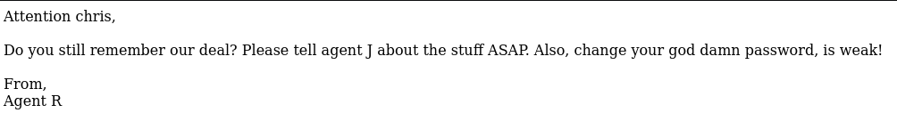
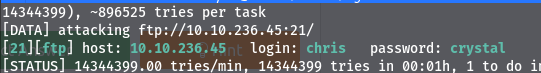
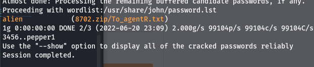
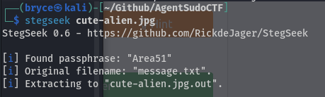
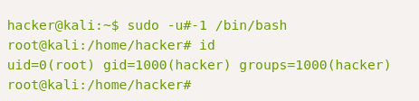

# Task 2 - Enumerate

### How many open ports?

For this question and for general enumeration we can run an nmap scan.

sudo nmap -sV -sC -T5 -p- 10.10.236.45 -oN \~/Github/AgentSudoCTF/nmapscan.md

With this command we can scan all the ports for the machine's IP.

We find there are 3 ports open 21,22,80 which are ftp,ssh, and http.

### How you redirect yourself to a secret page?

For this question I went to the web page for the machine's IP and we can see the page says "Use your owncodename as user-agent to access the site" so the way we will have to redirect ourselves is using user-agent

### What is the agent name?

Using the user agent switcher plugin as the hint suggests allows us to change the user agent to C it mentioned.

# Task 3 - Hash cracking and brute-force

### FTP password

Using the user we found on the web page we can try brute forcing the FTP password

hydra -t 16 -l chris -P /usr/share/wordlists/rockyou.txt ftp://10.10.236.45

Finally we get the password: crystal

### Zip file password

We were able to extract data out of the .jpg using steghide but for the .png file I had to try a couple of different tools. Steghide did not support the file type, exiftool did not find any data, but when I used binwalk I was able to extract the zip file that we need for this question

now that we have a zip file we can use "zip2john 8702.zip > hashes.txt" to output the password hashes to a text file then we can use john hashes.txt to crack the password for the zip file

### steg password

From the images that we found in Chris's ftp directory we can use a tool called stegseek to crack the password for possible hidden files in the images

### Who is the other agent (in full name)?

From the message.txt file that we got from the encrypted zip file we can see the other agent is james.

### SSH password

Also in the message.txt file chris is telling james that is password is hackerrules!

# Task 4 - Capture the flag

### What is the user flag?

Now that we have james' password we can log in to ssh as james and see the user_flag.txt file: b03d975e8c92a7c04146cfa7a5a313c7

### What is the incident of the photo called?

For this challenge we can run a reverse image search. First we need to get the image file on our local machine so we can use scp james@10.10.236.45:/home/james/Alien_autospy.jpg . to copy the file to our current directory

After doing a reverse image search we can find the incident is called the Roswell alien autopsy

# Task 5 - Privilege escaltion

### CVE number for the escalation

using the command sudo -l we can see that james is a sudoer and using the command sudo -V we can see the sudo version and search exploitDB for that version. We can see there is a sudo 1.8.27 - Security Bypass exploit that may be useful.

The CVE is CVE-2019-14287

### What is the root flag?

Now that we have a root shell we can go to /root and run "cat root.txt" for the root flag

b53a02f55b57d4439e3341834d70c062

### (Bonus) Who is Agent R?

When viewing the contents at the end we can see Agent R is also known as DesKel