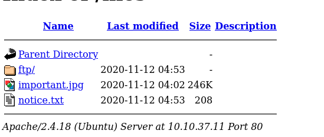
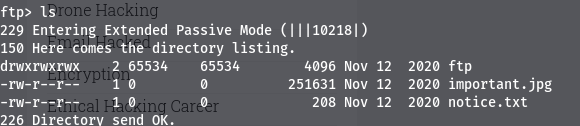
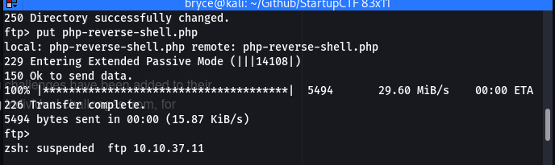
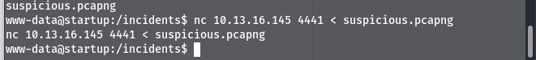
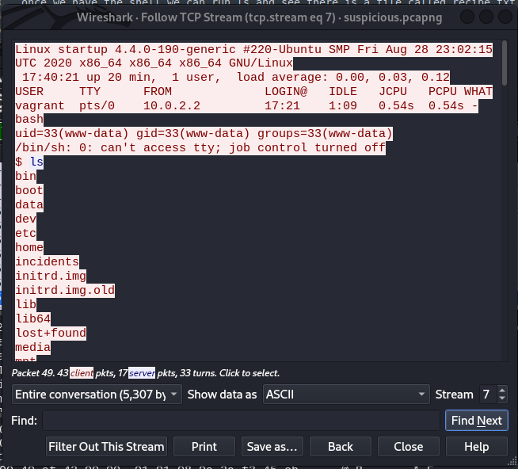
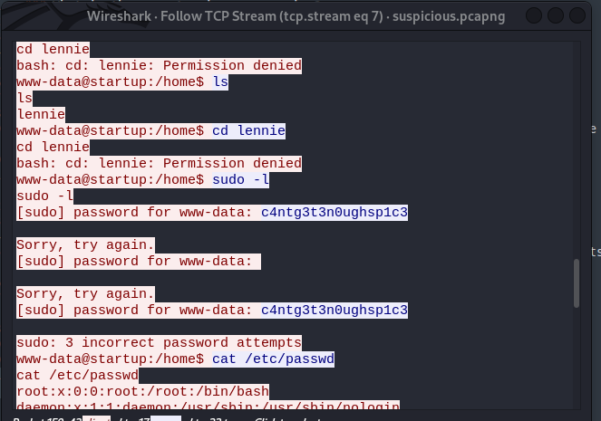
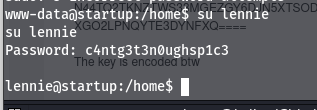
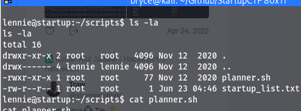
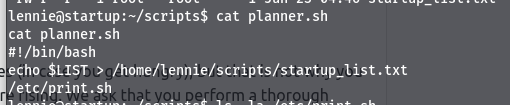
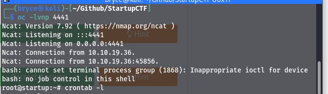

# Task 1 - Welcome to Spice Hunt!

## Enumeration

sudo nmap -sV -sC -T5 -p- 10.10.37.11 -oN \~/Github/StartupCTF/nmapscan.md

gobuster dir -u http://10.10.37.11 -w /usr/share/wordlists/dirbuster/directory-list-2.3-medium.txt -t 60 -q

From the nmap scan we can see there are 3 ports open 21,22,80

The gobuster scan returned a /files directory that I thought was interesting.

Logging into the machine using the anonymous user in ftp we are able to see the same files that are located in the /files directory

There is an ftp folder that I think is interesting and we may be able to upload files through ftp.

We can see that for the ftp folder we have full permissions so getting a shell should be pretty easy.

We were able to upload the php file once inside the ftp folder using the put command.

then inside the ftp folder on the web page we can open up the php file and we have a shell

we can then use the command python -c 'import pty;pty.spawn("/bin/bash")' to solidify the shell

### What is the secret spicy soup recipe?

once we have the shell we can run ls and see there is a file called recipe.txt

we can run "cat recipe.txt" and see the secret recipe is "love"

since we were able to read that file I ran ls -la to see what other files do we have permissions for.

there is a /incidents directory that has a suspicious.pcapng file. Send that file over to our local machine

Since we have the pcap file now I can start looking around the different packets to see if there is anything that is worth reading.

Finally we find a stream that has some good information. We can right click a packt and click follow to see the contents of the packet.

It looks like a remote shell session if we scroll down we can see the contents of the password

lennie:c4ntg3t3n0ughsp1c3

The password is incorrect for the www-data user but it may work for the lennie user since they are trying to access the lennie directory.

We can run su lennie to change users to the lennie user after we input the password we found

Now we have changed to the lennie user

### What are the contents of user.txt?

Now we can cd into the lennie user and ls to find user.txt that has our user flag
THM{03ce3d619b80ccbfb3b7fc81e46c0e79}

### What are the contents of root.txt?

along side the user.txt file in the lennie directory there is also another directory named scripts and we are able to go in and see 2 files

there is a bash script as well as a .txt file

catting out the planner file we can see that it writes to the .txt file and then runs another bash file that is in the /etc directory

When we run ls -la /etc/print.sh we can see that lennie owns this file. So we can edit that file to give us a reverse shell.

running crontab -l shows us that the /home/lennie/scripts/planner.sh file does run automatically

So we can edit the print.sh file, then root (the owner of planner.sh) will run planner.sh automatically and that will run the print.sh file that has our reverse shell which our listener will be waiting for.

Now we have a shell as root, we can go to /root directory and find root.txt

root.txt:THM{f963aaa6a430f210222158ae15c3d76d}

### Summary

In this box we were able to gain an inital shell by uploading a php file through ftp then use the contents of a .pcap file to find the password for the user lennie. Then we were able to look at permissions for different files in the /lennie directory and see that we are able to edit a bash file. Then using the command crontab -l we were able to see what file will be running automatically and that would give us a root shell.