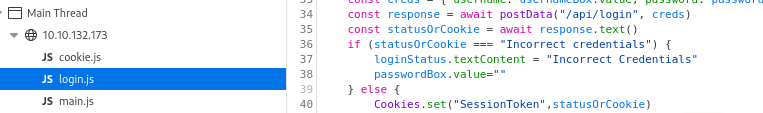
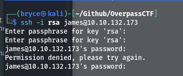
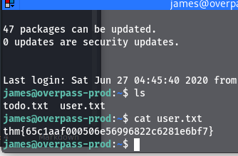
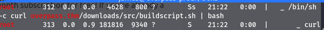
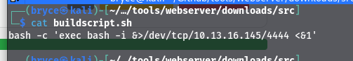
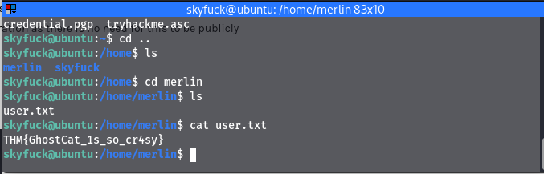

# Task 1 - Overpass

## Enumeration

sudo nmap -sV -sC -T5 -p- 10.10.24.76 -oN \~/Github/OverpassCTF/nmapscan.md

gobuster dir -u http://10.10.24.76 -w /usr/share/wordlists/dirbuster/directory-list-2.3-medium.txt -t 60 -q

From the nmap scan we are able to see there are 2 ports open 22 and 80.

From the gobuster scan there is a directory called /admin

Going to the admin page we see there is an option to log in. Trying some of the default credentials and insecure passwords did not let me in.

We can inspect the elements of the page and find a login.js.

Here we can see a function we may be able to exploit.

Since we are working with a website I'm going to start up Burp Suite so we can make some changes before the reqests are sent to the server. Now we can set it to intercept the response to our login request.

Let's remove the "Incorrect Credentials" message and see what we get on the web page.

### Hack the machine and get the flag in user.txt

We don't get the incorrect credentials message if we refresh the screen we can see a RSA private key that is exposed

in this message we can also see a username "James"

after trying to connect to the james user on ssh with the private key using
ssh -i rsa james@10.10.132.173

we got an error saying the rsa key file is not protected we can change that by entering chmod 600 rsa so only the owner has access to read and write to the file.

now we can try to connect, and we'll find the RSA key needs a passphrase that we don't have.

Since the file is on our local machine it is a lot easier to crack the hash. so we can use ssh2john to convert the file into a crackable hash

then use john the ripper to crack the hash

john --wordlist=/usr/share/wordlists/rockyou.txt rsa.hash

Then we get the passphrase in just a couple of seconds: james13

Now we should be able to connect using SSH

Success, and we found the user flag

user.txt:thm{65c1aaf000506e56996822c6281e6bf7}

## Privliege Escalation

For priviliege escalation I looked around the file system with ls and sudo -l but we do not have James' password so we weren't able to do that

Then I uploaded linpeas to the remote host and ran it.

We then found there is a cronjob that is running a bash file every minute.

We see that it is curling a file from the overpass.thm domain and piping it to bash.

We should be able to go into /etc/hosts and change the overpass.thm domain to redirect to our own IP

once we do that we need to create the same directories that are in the cron job.

So I created /downloads/src/ and then we can create a bash scripted named buildscript.sh

Then we put a reverse shell script in the file.

Now we have to go back to our base directory that we created /downloads/src/buildscript.sh from so we can start up a web server from there.

Once we have the webserver started we can start a netcat listener in another terminal on the same port that we denoted in the script (4444)

Then after a couple of seconds we get a root shell on the machine

now we can go into the /root directory and get the root flag

## Summary

For this machine we were able to edit a web response via burpsuite to expose a private RSA key that we then decrypted to get a user shell for user James. Then we were able to abuse a cronjob to run a reverse shell in order to get a root shell.

Things I want to look into further is Linpeas and how to save that on my own machine because I don't understand that tool as well as I would like to.